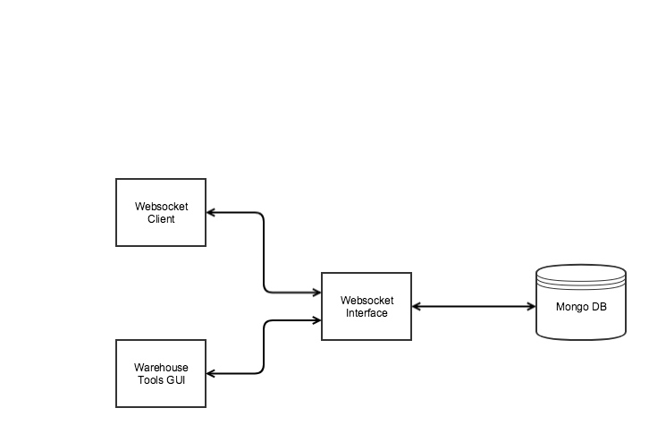

# Connected Vehicles WebFragment WebSocket Project

The fedgov-cv-webfragment-websocket project is a library containing a simple WebSocket Server implemented as a WebFragment.



<a name="toc"/>

## Table of Contents

[I. Release Notes](#release-notes)

[II. Documentation](#documentation)

[III. Getting Started](#getting-started)

[IV. Building](#building)

[V. Deploying](#deploying)

---

<a name="release-notes" id="release-notes"/>

## [I. Release Notes](ReleaseNotes.md)

<a name="documentation"/>

## II. Documentation

This repository produces a JAR file containing a Web Fragment, so it can be incorporated into a WAR file and deployed.

<a name="getting-started"/>

## III. Getting Started

The following instructions describe the procedure to fetch, build, and run the application

### Prerequisites
* JDK 1.8: http://www.oracle.com/technetwork/pt/java/javase/downloads/jdk8-downloads-2133151.html
* Maven: https://maven.apache.org/install.html
* Git: https://git-scm.com/
* Docker: https://docs.docker.com/engine/installation/
* PER XER Codec: https://github.com/usdot-jpo-sdcsdw/per-xer-codec

---
### Obtain the Source Code

#### Step 1 - Clone public repository

Clone the source code from the GitHub repository using Git command:

```bash
git clone TBD
```

<a name="building"/>

## IV. Building

**Step 1**: Build the JAR file

```bash
mvn package
```

<a name="deploying"/>

## V. Deploying

As this project depends on the PER XER Codec, both the JAR file and the native shared object produced by that project need to be deployed according to its instructions. 

</a>